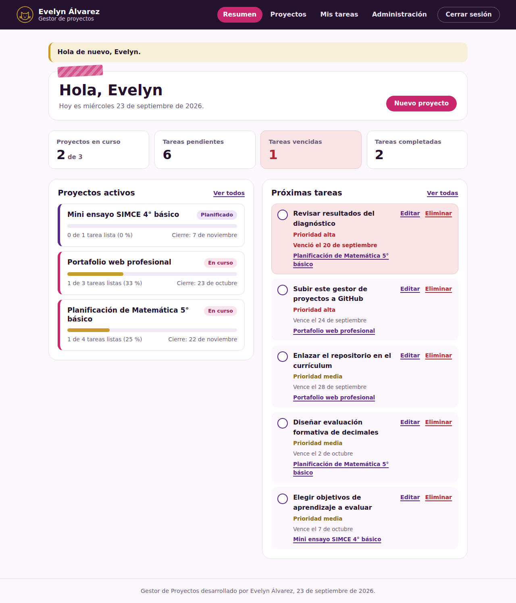

# Gestor de Proyectos · Evelyn Álvarez

Aplicación web desarrollada en **Django 5.2** para registrarse, iniciar sesión y gestionar proyectos y tareas, con seguimiento del avance de cada proyecto, sitio administrativo personalizado y pruebas unitarias.

- **Autora:** Evelyn Álvarez ([github.com/evelyntec](https://github.com/evelyntec))
- **Fecha:** 23 de septiembre de 2026
- **Contexto:** Evaluación del Módulo 6 — Proyecto Django Web App (Alkemy)

## Funcionalidades

| Requerimiento | Implementación |
| --- | --- |
| Registro y autenticación | `django.contrib.auth` con `LoginView`, `LogoutView` y formulario de registro propio (`RegistroForm`, basado en `UserCreationForm`). |
| Redirecciones post-login y logout | `LOGIN_URL`, `LOGIN_REDIRECT_URL` y `LOGOUT_REDIRECT_URL` en `config/settings.py`. |
| Restricción de acceso | Todas las vistas de proyectos y tareas usan `LoginRequiredMixin` y filtran por el usuario conectado; un recurso ajeno responde 404. |
| Modelos | `Proyecto` (pertenece a un usuario) y `Tarea` (pertenece a un proyecto). Un usuario gestiona múltiples proyectos y, a través de ellos, múltiples tareas. |
| CRUD completo | Crear, ver, editar y eliminar proyectos y tareas, además de marcar tareas como completadas. |
| Herencia de plantillas | `base.html` + plantillas hijas y parciales reutilizables (`partials/`). |
| Formularios con validaciones | `forms.ModelForm` con validaciones de nombre único por usuario, fechas coherentes, fechas no pasadas y normalización de textos. |
| Contexto dinámico | Resumen con indicadores, porcentaje de avance, tareas próximas y vencidas, filtros y búsqueda. |
| Sitio administrativo | Modelos registrados en `admin.py` con filtros, búsqueda, edición en lista, tareas en línea, acciones masivas y administración de usuarios con acciones para activar, desactivar y dar acceso al panel. Colores y logo de la marca. |
| Seguridad | `CsrfViewMiddleware` y `` en todos los formularios POST, cierre de sesión por POST, validación de redirecciones, cookies `HttpOnly` y ajustes seguros cuando `DEBUG=False`. |
| Pruebas | 43 pruebas unitarias de modelos, formularios y vistas. |

## Tecnologías

- Python 3.10 o superior
- Django 5.2
- SQLite
- HTML y CSS propios (sin frameworks), tipografías Fredoka y Nunito

## Estructura del proyecto

```
gestor-proyectos-evelyn/
├── manage.py
├── requirements.txt
├── README.md
├── config/
│   ├── settings.py
│   ├── urls.py
│   ├── wsgi.py
│   └── asgi.py
├── usuarios/
│   ├── admin.py
│   ├── apps.py
│   ├── forms.py
│   ├── tests.py
│   ├── urls.py
│   └── views.py
├── proyectos/
│   ├── admin.py
│   ├── apps.py
│   ├── forms.py
│   ├── models.py
│   ├── tests.py
│   ├── urls.py
│   ├── views.py
│   ├── migrations/
│   │   └── 0001_initial.py
│   └── management/commands/
│       └── cargar_demo.py
├── templates/
│   ├── base.html
│   ├── admin/base_site.html
│   ├── partials/
│   │   ├── formulario.html
│   │   ├── logo.html
│   │   ├── mensajes.html
│   │   ├── paginacion.html
│   │   └── tarea_item.html
│   ├── registration/
│   │   ├── login.html
│   │   └── registro.html
│   └── proyectos/
│       ├── resumen.html
│       ├── _proyecto_fila.html
│       ├── proyecto_list.html
│       ├── proyecto_detail.html
│       ├── proyecto_form.html
│       ├── proyecto_confirm_delete.html
│       ├── tarea_list.html
│       ├── tarea_form.html
│       └── tarea_confirm_delete.html
├── static/css/estilos.css
└── docs/capturas/
```

## Instalación

1. Clonar el repositorio y entrar a la carpeta:

   ```bash
   git clone https://github.com/evelyntec/gestor-proyectos-evelyn.git
   cd gestor-proyectos-evelyn
   ```

2. Crear y activar un entorno virtual:

   ```bash
   python -m venv .venv
   ```

   - Windows: `.venv\Scripts\activate`
   - Linux o macOS: `source .venv/bin/activate`

3. Instalar dependencias:

   ```bash
   pip install -r requirements.txt
   ```

4. Crear la base de datos:

   ```bash
   python manage.py migrate
   ```

5. Crear un superusuario para el sitio administrativo:

   ```bash
   python manage.py createsuperuser
   ```

6. (Opcional) Cargar datos de ejemplo:

   ```bash
   python manage.py cargar_demo
   ```

   Crea la cuenta `evelyn` con contraseña `Evelyn2026!`, tres proyectos y varias tareas.

7. Iniciar el servidor:

   ```bash
   python manage.py runserver
   ```

   Abrir http://127.0.0.1:8000/

## Uso

| Ruta | Descripción |
| --- | --- |
| `/cuentas/registro/` | Crear una cuenta nueva. |
| `/cuentas/ingresar/` | Iniciar sesión. |
| `/` | Resumen con indicadores, proyectos activos y próximas tareas. |
| `/proyectos/` | Listado de proyectos con búsqueda, filtro por estado y paginación. |
| `/proyectos/nuevo/` | Crear un proyecto. |
| `/proyectos/<id>/` | Detalle del proyecto, avance y tareas. |
| `/proyectos/<id>/editar/` y `/eliminar/` | Editar o eliminar un proyecto. |
| `/proyectos/<id>/tareas/nueva/` | Agregar una tarea al proyecto. |
| `/tareas/` | Todas las tareas del usuario, filtradas por pendientes, vencidas, completadas o todas. |
| `/admin/` | Sitio administrativo (requiere cuenta de staff). |

Para completar o reabrir una tarea basta con presionar el círculo a la izquierda de su título.

## Validaciones implementadas

- El nombre del proyecto es obligatorio, tiene al menos 3 caracteres y no puede repetirse para el mismo usuario (sin distinguir mayúsculas ni espacios extra).
- La fecha límite del proyecto no puede ser anterior a su fecha de inicio.
- La fecha límite de una tarea nueva no puede estar en el pasado ni superar el cierre del proyecto.
- El correo del registro debe ser único y la contraseña debe cumplir los validadores de Django.

## Pruebas unitarias

```bash
python manage.py test
```

Resultado esperado:

```
Found 43 test(s).
...........................................
Ran 43 tests in ...s

OK
```

| Archivo | Qué se prueba |
| --- | --- |
| `proyectos/tests.py` | Modelos (`__str__`, avance, validación de fechas, eliminación en cascada, relación usuario-proyectos-tareas), formularios (nombre duplicado, fechas inválidas, normalización) y vistas (acceso con login, aislamiento entre usuarios, CRUD de proyectos y tareas, alternar estado, redirecciones seguras, CSRF). |
| `usuarios/tests.py` | Registro, correo duplicado, contraseñas débiles o distintas, login, logout por POST y protección CSRF. |

## Seguridad en producción

Definir variables de entorno antes de publicar:

```bash
DJANGO_SECRET_KEY="una-clave-larga-y-secreta"
DJANGO_DEBUG="False"
DJANGO_ALLOWED_HOSTS="midominio.cl"
```

Con `DEBUG=False` se activan cookies seguras, redirección a HTTPS y HSTS. Luego ejecutar `python manage.py collectstatic`.

## Capturas de pantalla

| Pantalla | Archivo |
| --- | --- |
| Inicio de sesión | `docs/capturas/01_login.png` |
| Registro | `docs/capturas/02_registro.png` |
| Resumen | `docs/capturas/03_resumen.png` |
| Listado de proyectos | `docs/capturas/04_proyectos.png` |
| Detalle de proyecto | `docs/capturas/05_detalle_proyecto.png` |
| Validaciones del formulario | `docs/capturas/06_validaciones_formulario.png` |
| Mis tareas | `docs/capturas/07_mis_tareas.png` |
| Vista móvil | `docs/capturas/08_resumen_movil.png` |
| Admin de proyectos | `docs/capturas/09_admin_proyectos.png` |
| Admin de usuarios | `docs/capturas/10_admin_usuarios.png` |



## Autora

**Evelyn Álvarez** — 23 de septiembre de 2026
